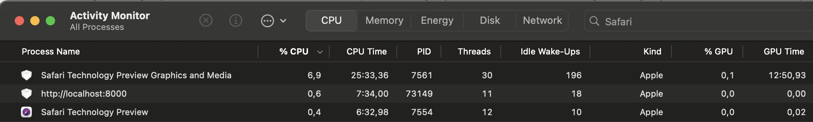
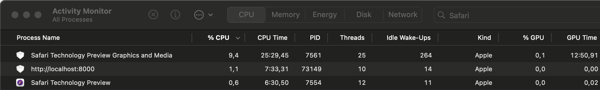
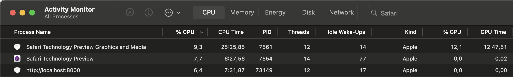
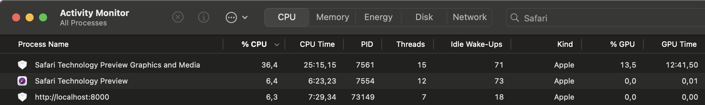
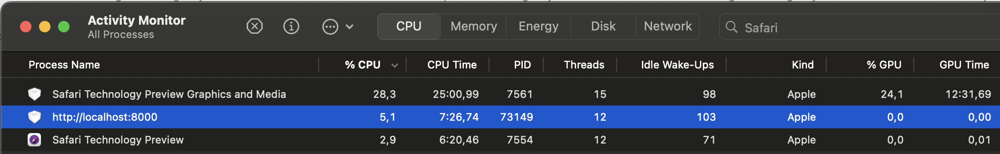
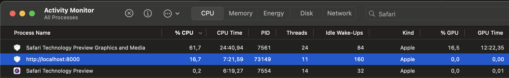

# WebKit performance demos

The live demos hosted via GitHub Pages.
Each demo is static HTML file with either embedded or included static js file.
The performance data collected on MacBook Pro 16" with Apple M2 Pro and 32 GB RAM.
The version of **Safari Technology Preview used is Release 219 (Safari 18.4, WebKit 20622.1.12)**.
The version of XCode Instruments is 16.
XCode Instrument profiles were recorded twice once with CPU profiler preset, another with Time profiler preset.
Each XCode trace file has 2 sessions one with data for GPU process and one with data for WebContent process.
The trace files produce by Time Profiler were converted to format accepted by https://profiler.firefox.com/ with [instruments-to-gecko](https://github.com/benjaminRomano/instruments-to-gecko) tool.

## Single H.264-encoded 4K video at 60 FPS played from file

**Goal**: Estimate how much CPU resources a browser consumes when playing high-resolution, high-frame-rate video

**Description**: The demo is video playback of `4k` `60 fps` video via `<video>` element.

* [Open](https://mstyura.github.io/webkit-issues/video-transform-pipeline/00-one-video/index.html) demo; 
* [View source of `index.html`](https://github.com/mstyura/webkit-issues/blob/main/video-transform-pipeline/00-one-video/index.html);
* [Open](https://share.firefox.dev/440aoPu) WebGPU profile;
* [Open](https://share.firefox.dev/4jqTmOV) WebContent profile;
* [Download](https://mstyura.github.io/webkit-profiler-data/cpu-profiler/00-one-video.trace.tar.gz) XCode trace file (CPU profiler);
* [Download](https://mstyura.github.io/webkit-profiler-data/time-profiler/00-one-video.trace.tar.gz) XCode trace file (Time profiler);

* <details>
  <summary>
  Activity Monitor screenshot
  </summary>

  
  </details>

**Observation**: The playback of regular video file is well optimized barely consuming CPU within WebContent process and GPU process consuming around `7%` of CPU on test environment.


## Render 1080p 30 FPS video from local camera

**Goal**: Estimate how much CPU resources are consumed by the browser to capture and render high-resolution video from the camera;

**Description**: The demo requests access to the camera when the user clicks a button and renders the captured `MediaStream` via a `<video>` element;

* [Open](https://mstyura.github.io/webkit-issues/video-transform-pipeline/01-one-camera-video/index.html) demo;
* [View source of `index.html`](https://github.com/mstyura/webkit-issues/blob/main/video-transform-pipeline/01-one-camera-video/index.html);
* [Open](https://share.firefox.dev/4juw2A5) WebGPU profile;
* [Open](https://share.firefox.dev/3SvQOUT) WebContent profile;
* [Download](https://mstyura.github.io/webkit-profiler-data/cpu-profiler/01-one-camera-video.trace.tar.gz) XCode trace file (CPU profiler);
* [Download](https://mstyura.github.io/webkit-profiler-data/time-profiler/01-one-camera-video.trace.tar.gz) XCode trace file (Time profiler);
* <details>
  <summary>
  Activity Monitor screenshot
  </summary>

  
  </details>

**Observation**: When video comes from the local camera and is rendered by the browser via a `<video>` element, it consumes more `CPU` in both the `WebContent` and `GPU` processes - even though the camera is captured at `1080p` and `30 FPS`, whereas the previous demo rendered `4K` video at `60 FPS`.


## Render moving triangle on 4k `<canvas>` via `WebGL` on main thread;

**Goal**: Estimate how much CPU resources are consumed when rendering simple WebGL program in `4K` at `60 FPS`.

**Description**: The demo renders a spinning triangle on a `<canvas>` with 4K resolution on the main thread.

* [Open](https://mstyura.github.io/webkit-issues/video-transform-pipeline/02-triangle-canvas-main/index.html) demo;
* [View source of `index.html`](https://github.com/mstyura/webkit-issues/blob/main/video-transform-pipeline/02-triangle-canvas-main/index.html);
* [Open](https://share.firefox.dev/4klHxe9) WebGPU profile;
* [Open](https://share.firefox.dev/43v7ZfG) WebContent profile;
* [Download](https://mstyura.github.io/webkit-profiler-data/cpu-profiler/02-triangle-canvas-main.trace.tar.gz) XCode trace file (CPU profiler);
* [Download](https://mstyura.github.io/webkit-profiler-data/time-profiler/02-triangle-canvas-main.trace.tar.gz) XCode trace file (Time profiler);
* <details>
  <summary>
  Activity Monitor screenshot
  </summary>

  
  </details>

**Observation**: The computation resources required around `15%` in total for GPU and WebContent processes.

## Mirror 4k `<canvas>` to `<video>` element via `HTMLCanvasElement.captureStream`

**Goal**: Estimate the overhead of the `HTMLCanvasElement.captureStream` implementation.

**Description**: The demo renders a spinning triangle on a `4K` `<canvas>`, which is then captured as a `MediaStream` and displayed in a neighboring `<video>` element on the page.

* [Open](https://mstyura.github.io/webkit-issues/video-transform-pipeline/03-triangle-canvas-main-capture-stream-mirror/index.html) demo;
* [View source of `index.html`](https://github.com/mstyura/webkit-issues/blob/main/video-transform-pipeline/03-triangle-canvas-main-capture-stream-mirror/index.html);
* [Open](https://share.firefox.dev/4jufNTp) WebGPU profile;
* [Open](https://share.firefox.dev/3SB1amu) WebContent profile;
* [Download](https://mstyura.github.io/webkit-profiler-data/cpu-profiler/03-triangle-canvas-main-capture-stream-mirror.trace.tar.gz) XCode trace file (CPU profiler);
* [Download](https://mstyura.github.io/webkit-profiler-data/time-profiler/03-triangle-canvas-main-capture-stream-mirror.trace.tar.gz) XCode trace file (Time profiler);
* <details>
  <summary>
  Activity Monitor screenshot
  </summary>

  
  </details>

**Observation**: The `GPU` process began consuming significantly more CPU - `3.5` times more than in the previous demo. The notable new `CPU` consumers in the `GPU` process are:
```
485.86 Mc  33,2%	          WebCore::GraphicsContextGLCocoa::surfaceBufferToVideoFrame(WebCore::GraphicsContextGLSurfaceBuffer)
155.64 Mc  10,6%	           WebCore::LocalSampleBufferDisplayLayer::enqueueBufferInternal(__CVBuffer*, WTF::MediaTime)
130.10 Mc   8,9%	         CAImageQueueCollect_
```
The `CPU` profile of `WebContent` process didn't change much.

## Render a moving triangle on a 4K `OffscreenCanvas` using `WebGL` in a worker

**Goal**: Estimate the `CPU` overhead of the automatic synchronization of an `OffscreenCanvas`'s content to its associated `<canvas>`.

**Description**: The demo has regular `<canvas>` which has associated `OffscreenCanvas` obtained via `transferControlToOffscreen`. The `OffscreenCanvas` is transferred to `Worker` and used to render spinning triangle in `4k` `60 FPS`.

* [Open](https://mstyura.github.io/webkit-issues/video-transform-pipeline/04-triangle-canvas-worker/index.html) demo;
* [View source of `index.html`](https://github.com/mstyura/webkit-issues/blob/main/video-transform-pipeline/04-triangle-canvas-worker/index.html);
* [View source of `worker.js`](https://github.com/mstyura/webkit-issues/blob/main/video-transform-pipeline/04-triangle-canvas-worker/worker.js);
* [Open](https://share.firefox.dev/45CKsKU) WebGPU profile;
* [Open](https://share.firefox.dev/4kPkZT8) WebContent profile;
* [Download](https://mstyura.github.io/webkit-profiler-data/cpu-profiler/04-triangle-canvas-worker.trace.tar.gz) XCode trace file (CPU profiler);
* [Download](https://mstyura.github.io/webkit-profiler-data/time-profiler/04-triangle-canvas-worker.trace.tar.gz) XCode trace file (Time profiler);
* <details>
  <summary>
  Activity Monitor screenshot
  </summary>

  
  </details>

**Observations**: Rendering to an `OffscreenCanvas` associated with a `<canvas>` from a worker is significantly more expensive than rendering directly to a `<canvas>` on the main thread. Most of the additional `CPU` usage occurs in the `GPU` process—approximately `2.9` times more compared to main-thread rendering. The primary contributor to this increased `CPU` usage is:
```
158.27 Mc  35,2%	         CA::CG::Queue::render_callback(void*)
```


## Produce a `MediaStreamTrack` via `VideoTrackGenerator` from an `OffscreenCanvas` rendered in a worker.

**Goal**: Estimate the CPU usage of producing `MediaStreamTrack` from `OffscreenCanvas` rendered in `Worker`.

**Description**: The demo creates an `OffscreenCanvas` within a worker and uses it to render a rotating triangle. A `VideoTrackGenerator` is then used to produce a `MediaStreamTrack` from the rendered frames by creating `VideoFrame` objects from the `OffscreenCanvas`.

* [Open](https://mstyura.github.io/webkit-issues/video-transform-pipeline/05-triangle-offscreen-video-track-generator/index.html) demo;
* [View source of `index.html`](https://github.com/mstyura/webkit-issues/blob/main/video-transform-pipeline/05-triangle-offscreen-video-track-generator/index.html);
* [View source of `worker.js`](https://github.com/mstyura/webkit-issues/blob/main/video-transform-pipeline/05-triangle-offscreen-video-track-generator/worker.js);
* [Open](https://share.firefox.dev/4jy8DO6) WebGPU profile;
* [Open](https://share.firefox.dev/3SyPUa5) WebContent profile;
* [Download](https://mstyura.github.io/webkit-profiler-data/cpu-profiler/05-triangle-offscreen-video-track-generator.trace.tar.gz) XCode trace file (CPU profiler);
* [Download](https://mstyura.github.io/webkit-profiler-data/time-profiler/05-triangle-offscreen-video-track-generator.trace.tar.gz) XCode trace file (Time profiler);
* <details>
  <summary>
  Activity Monitor screenshot
  </summary>

  
  </details>

**Observations**: Creating a `MediaStream` via `VideoTrackGenerator` is extremely `CPU`-intensive, involving numerous memory copies and redundant trivial pixel transformations. The notable `CPU` consumers within the `GPU` process are:
```
7.00 Gc  73,4%	   Do_vImageUnpremultiplyData_RGBA8888
1.21 Gc  12,7%	   WebCore::SharedVideoFrameInfo::createPixelBufferFromMemory(std::__1::span<unsigned char const, 18446744073709551615ul>, __CVPixelBufferPool*)
986.77 Mc  10,3%	   WebKit::RemoteImageBuffer::getPixelBuffer(WebCore::PixelBufferFormat, WebCore::IntPoint, WebCore::IntSize, WTF::CompletionHandler<void ()>&&)
```
